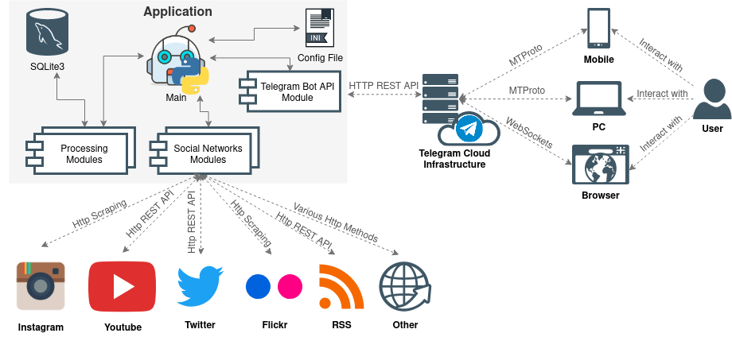

<div align="center">


# FeedGram

[](https://gitlab.com/meliurwen/feedgram/commits/master) [](https://gitlab.com/meliurwen/feedgram/commits/master) [](https://gitlab.com/meliurwen/feedgram/-/jobs/artifacts/master/raw/pylint/pylint.log?job=pylint) [](https://gitlab.com/meliurwen/feedgram/-/jobs/artifacts/master/raw/pylint/app_version.svg?job=pylint) [](https://gitlab.com/meliurwen/feedgram/blob/master/LICENSE)

[](https://gitlab.com/meliurwen/feedgram/-/jobs/artifacts/master/raw/pylint/plaform.svg?job=pylint) [](https://gitlab.com/meliurwen/feedgram/-/jobs/artifacts/master/raw/pylint/python_ver.svg?job=pylint) [](https://gitlab.com/meliurwen/feedgram/-/jobs/artifacts/master/raw/pylint/wheel.svg?job=pylint) [](https://gitlab.com/meliurwen/feedgram/-/jobs/artifacts/master/raw/pylint/pip_install.svg?job=pylint)

</div>

# 2020 Laboratorio di Progettazione

> **_Note:_** It's a private repo, use the `LabProgettazioneDISCo` Gitlab's user in order to access it!

+ **_Project's Link:_** https://gitlab.com/meliurwen/feedgram
+ **_Demo Link:_** https://t.me/FeedGram_demo_bot

## Group Members

+ Salanti Michele - 793891
+ Donati Ivan - 781022

## Purpose

Acquire, through experimental activities, the skills necessary to independently develop a system using agile methodologies by practicing the knowledge acquired during the course of studies.

In this project we'll use **_Trello_** in combination with the _Gitlab's_ **_git_** and **_CI/CD_** infrastructure.

## App

> **Note:** At the moment it's in pre-alpha state; a sensible part of our available resources has been invested on the study on learning agile practices.

A simple to use, but yet powerful Telegram bot app living in the cloud with bare bones functionalities!  ☁️🗒

This **_multi-user bot_** allows to receive _news_, _RSS feeds_, _social networks and other platforms posts_ into a **_single and curated inbox_**!

The first platforms supported will be the most popular ones: _Instagram_, _Youtube_, _Flickr_, _Twitter_, _Artstation_, etc...

## Architecture

The diagram below is the **_high level architecture_** of this project and describes the _interactions_ between the _internal components_ of the app and between the app and the _external ones_:



As described by the diagram **_the bot does not interact directly with the users_**, but it accomplish this _via the Telegram's stack_ using _APIs expressively provided for the bots_.

The **_interactions with the socials/platforms_** will be done with various methods and techniques that depends on _how_ (and _at which conditions_) each social/platform we interact with exposes the data we need. In most cases _is better use the official APIs_ provided via _HTTP_ methods (GET or POST) or _OAuth_, but in few cases for various reasons the classic _scraping methods are more convenient_.

The **_internal structure_** of the application is mainly composed by a multitude of _specialised python modules_, an _SQLite3_ database and a config file in `ini` format, most of them directly orchestrated by a main module.

## Install

### From Compiled Packages

At the moment platforms officially supported are:

+ Docker
+ Debian 10
+ Ubuntu 18.04
+ Python Wheels

Go to the [releases section](https://gitlab.com/meliurwen/feedgram/-/releases) to download the latest installer:

## From Docker

**Prerequisites:**

+ `docker`

**Launch**

```sh
docker run registry.gitlab.com/meliurwen/feedgram:latest \
            -d --name feedgram --restart always
```

### From Source

**Prerequisites:**

+ `python3` (_>=3.6_)
+ `python3-setuptools`
+ `python3-pip`

**Install:**

At the _root_ of the project's folder launch:

```sh
pip3 install .
```

**Uninstall:**

Anywhere in the system launch:

```sh
pip3 uninstall <package_name>
```

**Upgrade:**

At the _root_ of the project's folder launch:

```sh
pip3 install --upgrade .
```

## Contribute

See [CONTRIBUTING.md](CONTRIBUTING.md) to know how to report bugs, propose features, merge requests or other forms of contribution! 😎🚀

## Develop

**Prerequisites:**

+ `python3` (_>=3.6_)
+ `python3-setuptools`
+ `python3-pip`
+ `python3-venv` (_optional_)

_Create_ the **_virtual environment_** in the project's folder:

```sh
python3 -m venv venv
```

Or if oyu wanna use the `virtualenv` package:

```sh
virtualenv -p python3 venv
```

_Activate_ the virtual environment:

```sh
source venv/bin/activate
```

_Prepare_ the development environment:

```sh
./setup.py develop
```

That's all! ☕️

> **Tip:** To deactivate the **_virtual environment_** simply issue the `deactivate` command.

## Testing & Linting

_Activate_ the **virtual environment** as described in [Develop](##Develop). (optional)

Install the dependencies:

```sh
pip3 install -r test-requirements.txt
```

To launch **Pytest**:

```sh
pytest
```

To launch **Pylint**:

```sh
pylint --output-format=text --rcfile=setup.cfg app/ test/ *.py
```

To launch **Flake8**:

```sh
flake8
```
